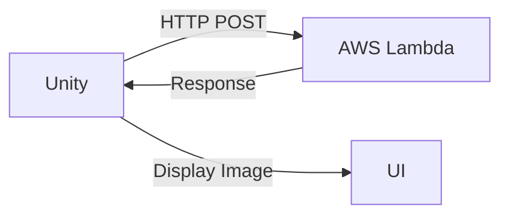
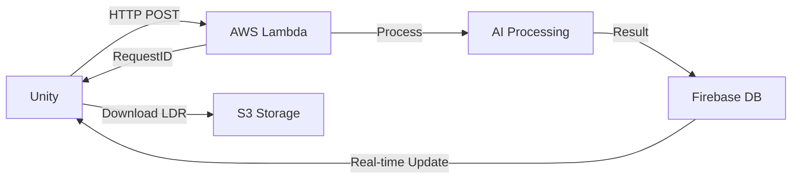

# **Flow AI Hoàn Chỉnh: Unity ↔ AWS ↔ Firebase**

## **Tổng Quan**

Hệ thống này cung cấp một flow AI hoàn chỉnh để tạo ảnh và LEGO từ Unity, kết nối với AWS Lambda và Firebase Realtime Database.

### **Kiến Trúc Hệ Thống**

```
Unity (Client)
    ↓ HTTP Request
AWS Lambda (AI Processing)
    ↓ Async Result
Firebase Realtime Database
    ↓ Real-time Listener
Unity (Callback)
```

---

## **Flow Chính**

### **1. Image Generation (Đồng bộ)**
- **Input**: Text prompt
- **Output**: Base64 image data (ngay lập tức)
- **Thời gian**: ~5-10 giây



### **2. LEGO Generation (Bất đồng bộ)**
- **Input**: Base64 image + settings
- **Output**: RequestID → Firebase Listener → LDR file
- **Thời gian**: ~30-120 giây



---

## **Cách Sử Dụng**

### **Setup Firebase**
1. Đảm bảo `FirebaseAuthManager` đã được setup và user đã đăng nhập
2. Firebase Realtime Database đã được cấu hình

### **Setup APIManager**
```csharp
// APIManager tự động khởi tạo khi scene load
// Đảm bảo có GameObject với APIManager component
```

### **Tạo Ảnh (Image Generation)**
```csharp
StartCoroutine(APIManager.Instance.CallGenImage("a red car", (response, error) =>
{
    if (error == null && response != null)
    {
        // Chuyển base64 thành Texture2D
        byte[] imageBytes = Convert.FromBase64String(response.image);
        Texture2D texture = new Texture2D(2, 2);
        texture.LoadImage(imageBytes);
        
        // Hiển thị ảnh
        imageComponent.texture = texture;
    }
    else
    {
        Debug.LogError($"Lỗi tạo ảnh: {error}");
    }
}));
```

### **Tạo LEGO (LEGO Generation)**
```csharp
StartCoroutine(APIManager.Instance.CallGenLego(base64Image, (modelData, error) =>
{
    if (error == null && modelData != null)
    {
        Debug.Log($"LEGO hoàn thành! URL: {modelData.model_url}");
        
        // Tải xuống file LDR
        StartCoroutine(LDRDownloader.DownloadLDRFile(modelData.model_url, (ldrContent, downloadError) =>
        {
            if (downloadError == null)
            {
                // Lưu file LDR
                string fileName = LDRDownloader.GetFileNameFromS3Url(modelData.model_url);
                LDRDownloader.SaveLDRToLocal(ldrContent, fileName);
                Debug.Log("Đã lưu file LDR thành công!");
            }
        }));
    }
    else
    {
        Debug.LogError($"Lỗi tạo LEGO: {error}");
    }
}, details: 0.02f, foregroundRatio: 0.85f));
```

---

## **API Configuration**

### **Endpoints**
- **Base URL**: `https://lvm3bok3icqnfhj2o7llcfxbbe0vwbxv.lambda-url.us-east-1.on.aws/`
- **Image**: `/gen_image`
- **LEGO**: `/gen_lego`

### **Request Format**
```json
{
    "path": "/gen_image",
    "user_id": "firebase_user_id",
    "options": {
        "authRequired": true
    },
    "prompt": "your prompt here"
}
```

### **Firebase Database Schema**
```
users/
  {user_id}/
    {request_id}/
      - requestId: string
      - user_id: string
      - status: "processing" | "success" | "failed"
      - model_url: string (S3 URL)
      - thumbnail_url: string
      - created_at: timestamp
      - category: string
      - description: string
```

---

## **Components Chính**

### **APIManager.cs**
- Singleton quản lý tất cả API calls
- Xử lý flow async cho LEGO generation
- Quản lý Firebase listeners

### **GenImageAPI.cs**
- Xử lý image generation
- Trả kết quả ngay lập tức

### **GenLegoAPI.cs**
- Xử lý LEGO generation requests
- Hỗ trợ tùy chỉnh `details` và `foregroundRatio`

### **RealtimeDatabaseListener.cs**
- Listen Firebase real-time updates
- Quản lý multiple concurrent requests
- Auto cleanup khi hoàn thành

### **LDRDownloader.cs**
- Tải xuống file LDR từ S3
- Lưu trữ local cache
- Hỗ trợ thumbnail download

### **AIFlowDemo.cs**
- Demo script hoàn chỉnh
- UI integration example
- Error handling

---

## **Error Handling**

### **Network Errors**
- Connection timeout
- HTTP error codes
- Malformed responses

### **Firebase Errors**
- Authentication failures
- Database permission errors
- Listener registration failures

### **Processing Errors**
- AI processing failures
- Invalid input data
- S3 download failures

---

## **Best Practices**

### **Performance**
- Cache downloaded LDR files locally
- Implement request throttling
- Use coroutines for non-blocking operations

### **Error Recovery**
- Retry mechanism for network failures
- Graceful degradation
- User-friendly error messages

### **Security**
- Always authenticate users
- Validate input data
- Use HTTPS for all requests

---

## **Troubleshooting**

### **Image Generation Không Hoạt Động**
1. Kiểm tra network connection
2. Verify API endpoint URL
3. Check Firebase authentication

### **LEGO Generation Không Nhận Kết Quả**
1. Kiểm tra Firebase Database rules
2. Verify user permissions
3. Check Firebase listener registration

### **File LDR Không Tải Được**
1. Verify S3 URL validity
2. Check presigned URL expiration
3. Ensure proper file format

---

## **Monitoring & Logging**

### **Unity Console**
- Request/Response logging
- Firebase event tracking
- Error stack traces

### **Firebase Console**
- Database activity monitoring
- User authentication logs
- Performance metrics

### **AWS CloudWatch**
- Lambda execution logs
- API Gateway metrics
- Error rate monitoring 